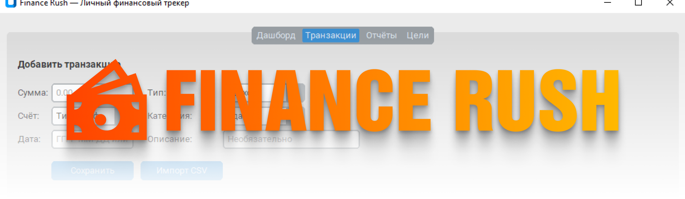

# Finance Rush



A local personal finance tracker: income and expenses, accounts, categories, simple reports, and bank statement import from CSV. Data stays on your machine—no cloud or sign-up.

## Features

- **Dashboard** — balances per account and recent transactions
- **Transactions** — manual entry, transaction list, CSV import with column mapping and deduplication
- **Reports** — income, expenses, and net for month / quarter / year / all time; pie chart of spending by category
- **Goals** — placeholder for future functionality

## Requirements

- Python **3.10+**
- Windows, macOS, or Linux (GUI built with [CustomTkinter](https://github.com/TomSchimansky/CustomTkinter))

## Install and run

```bash
git clone https://github.com/<user>/finance-rush.git
cd finance-rush
python -m venv .venv

# Windows
.\.venv\Scripts\activate
# Linux / macOS
# source .venv/bin/activate

pip install -r requirements.txt
python main.py
```

The transactions file is created automatically at `data/transactions.csv`.

## Build a standalone app (PyInstaller)

```bash
pip install pyinstaller
pyinstaller FinanceTracker.spec
```

Output: `dist/FinanceTracker/` (`onedir` layout).

## Project layout

| Path | Purpose |
|------|---------|
| `main.py` | Entry point |
| `config.py` | Data paths |
| `models.py` | `Transaction`, `Account` models |
| `storage.py` | CSV read/write |
| `reports.py` | Balances and aggregates for reports |
| `gui/` | UI (tabs, import) |
| `docs/` | PRD and roadmap |

More detail: [docs/specs.md](docs/specs.md), [docs/todo.md](docs/todo.md).

## License

MIT
